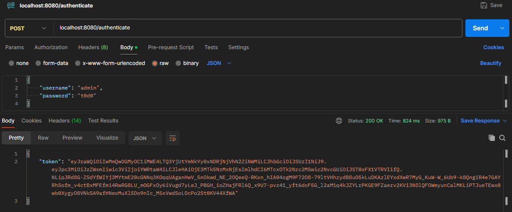
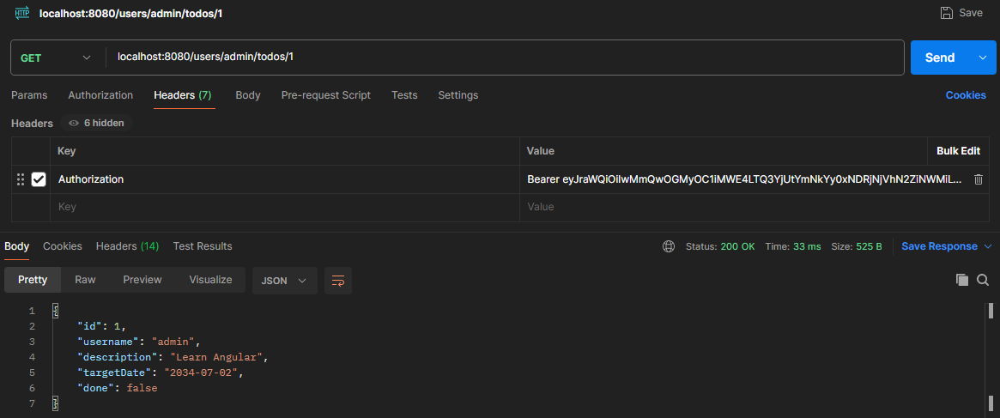

# TODO Management Backend

### Installing the Project

Install Docker Desktop and execute this command to launch MySQL as Docker Container:

```
docker run --detach --env MYSQL_ROOT_PASSWORD=t0d0s --env MYSQL_USER=todos-user --env MYSQL_PASSWORD=dummypassword --env MYSQL_DATABASE=todos-database --name mysql --publish 3306:3306 mysql:8-oracle
```

Open a terminal in the project directory and run the following command:

```
./mvnw spring-boot:run
```

### About this Project

This project is the backend part of a full-stack application for to-do management. It is developed using Spring Framework and provides a RESTful API for task management. Additionally, it features authentication and authorization using Spring Security and JWT.

### Endpoints

+ GET

    + **/users/{username}/todos** - Retrieves all tasks for the specified user.
  
    + **/users/{username}/todos/{id}** - Retrieves a specific task by its ID for the specified user.

+ POST

    + **/users/{username}/todos** - Creates a new task for the specified user.

+ PUT

    + **/users/{username}/todos/{id}** - Updates a specific task by its ID for the specified user.

+ DELETE

    + **/users/{username}/todos/{id}** - Deletes a specific task by its ID for the specified user.

### Authentication and Authorization

The project uses Spring Security and JWT for authentication and authorization. The default user is:

Username: admin

Password: t0d0

To test this project, make a POST request at localhost:8080/authenticate and paste the following body:

```
{
    "username": "admin",
    "password": "t0d0"
}
```

Copy the token that was generated.



Add a header with key ```Authorization```  and value ```Bearer [token you copied]```to make requests.



### Version

1.0

### Author

[Juan Pablo Sánchez Bermúdez](https://github.com/JuanPablo70)
