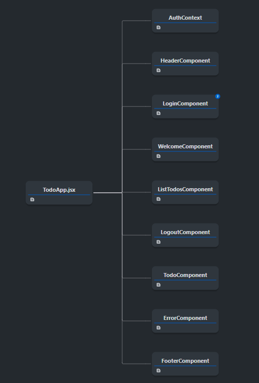

# TODO Management Frontend

### Installing the Project

Open a terminal in the project directory and run the following command:

```
npm install
npm start
```

Use your preferred browser and go to localhost:3000 or localhost:3000/login.

### About this Project

This project is the frontend part of a full-stack application for to-do management. It is developed using React and provides a user interface for managing tasks. The frontend communicates with the backend API to perform CRUD operations on the to-dos.

#### Components

<p align="center">
  
</p>

The application is structured into various components, as shown below:

+ **HeaderComponent:** Displays the application's header.

+ **LoginComponent:** Handles user authentication.

+ **WelcomeComponent:** Displays a welcome message to the user.

+ **ListTodosComponent:** Shows the list of all to-dos for the user.

+ **LogoutComponent:** Handles user logout.

+ **TodoComponent:** Manages individual to-do items.

+ **ErrorComponent:** Displays error messages.

+ **FooterComponent:** Displays the application's footer.

#### Context and Services

+ **AuthContext:** This context is responsible for handling user login with JWT and storing the user and token information. It ensures that authenticated requests can be made to the backend API to fetch to-do data.

+ **TodoApiService:** Contains all necessary requests to the backend API to retrieve and manipulate to-do information.

### Version

1.0

### Author

[Juan Pablo Sánchez Bermúdez](https://github.com/JuanPablo70)